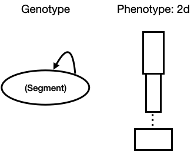
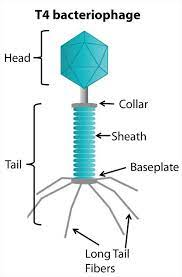
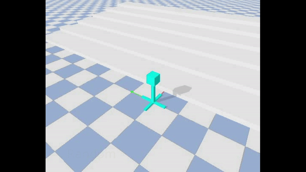
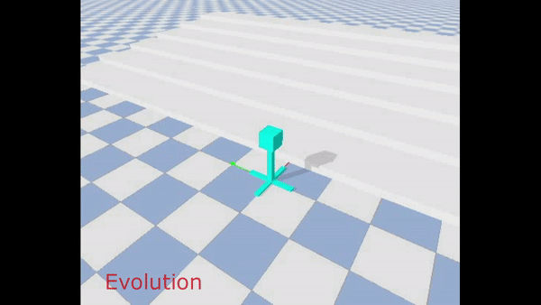

# Northwestern University Course - Artificial Life

## Assignment 6: generate random 1D creature morphologies

[video](https://youtu.be/ZTteUG4CstI)

### Step1. Run

  In this assignment, I create a program that generates a kinematic chain (a jointed, motorized, innervated, sensorized snake) with a: random number of randomly shaped links with random sensor placement along the chain. Links with and without sensors should be colored green and blue, respectively. Then I use EA(Evolutation Algorithm) to make robot crawl. The EA try to maximize the fitness function. The fitness of EA is `-Xposition`.

  Notice that this program needs at least 60 cpus to run. Because the `numberOfGenerations=3` and `populationSize=40`. To run the EA, use following command: 
  
  ```
  cd Assignment6
  python search.py
  ```

### Step2. Replay

  To replay a single result in the video, run this:
  
  ```
  cd Assignment6
  python replay.py best
  ```


   | 
  :-------------------------:|:-------------------------:


## Assignment 5: design your own creatures

[video](https://youtu.be/9l8x-92wuOg)

### Step1. Run

  In this assignment, I design a virus-shape robot, use EA(Evolutation Algorithm) to make robot climb steps. The EA try to maximize the fitness function. The fitness of EA is `Zposition+Xposition`.

  Notice that this program needs at least 60 cpus to run. Because the `numberOfGenerations=5` and `populationSize=60`. To run the EA, use following command: 
  
  ```
  cd Assignment5
  python search.py
  ```

### Step2. Replay
  
  To replay the results in the vidoes, run this:
  
  ```
  cd Assignment5
  python replay.py random
  python replay.py best
  ```

   | | 
  :-------------------------:|:-------------------------:|:-------------------------:

