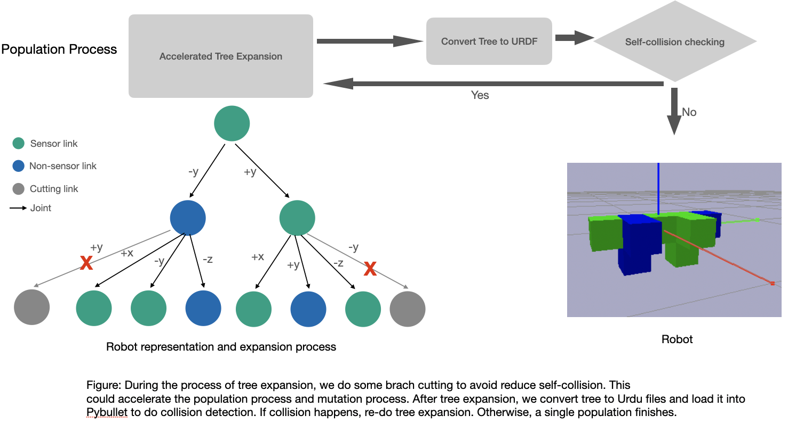

# Evolving Robots for Challenging Environments: Morphology Optimization for Versatile Locomotion.

  Qinjie Lin, 
  Northwestern University CS396 - Artificial Life, 
  Final Project, 

  <!-- [video](https://youtu.be/FtZl_7wjoMU) -->

# I Abstract

  Robots designed for specific tasks often struggle to adapt to new environments efficiently. In contrast, animals exhibit remarkable versatility in locomotion due to their diverse morphology. 
  Inspired by nature, we present a novel approach to optimize robot morphology for versatile locomotion in challenging environments using evolutionary algorithms. 
  The approach uses a two-level evolutionary optimization for desgin robots that are optimized for specific tasks. 
  Specifically, the first level is focused on evolving the robot's morphology using an evolutionary algorithm (EA), while the second level uses another EA to optimize the robot's control policy for the given morphology. The selection of the optimal morphology is based on the evaluation of the control EA, which provides a fitness measure for each morphology. 
  We demonstrate the effectiveness of our approach on a set of challenging tasks, including rough terrain traversal, obstacle avoidance bumper jumping, and step climbing. 
  Our optimized morphologies show remarkable versatility in these tasks, outperforming task-specific designs and demonstrating the potential of adaptable robots for real-world applications.

  


# II Method

  As shown in the following fugure, our method aims to optimize the morphology of a rigid-body robot for a specific task, such as locomotion in challenging terrain. We propose a two-level, or bi-level, evolutionary algorithm approach. At the first level, we use an evolutionary algorithm to optimize the robot's morphology, or its physical structure, to improve its performance on the task. At the second level, we use another evolutionary algorithm to optimize the robot's control policy, or the way it moves its body, based on the morphology selected from the first level.
    
  
  <!-- <p align="center">
  
  </p> -->

  ## II.I Morphology evolution

  Population: In this project, the Evolutionary Algorithm (EA) is used to optimize both the morphology and behavior of a robot for locomotion. The EA works by creating a population of candidate solutions (i.e. robots) and iteratively improving them through selection, reproduction, and mutation. We illustrate the population in the following figure.

  
  
  Mutation: Each candidate solution (robot) is evaluated using a fitness function that quantifies its performance in terms of locomotion. The fitness function takes into account the x position of the candidate body. After evaluating the fitness of each candidate solution, the EA selects the most fit solutions and uses them to create the next generation of robots through reproduction and mutation. The process continues until a satisfactory solution (i.e. robot) is found, or a certain stopping criterion (e.g. maximum number of generations) is met. We illustrate the mutation in the following figure.

  

  Selection: The selection step of the morphology evolution involves evaluating the fitness of the population of morphologies based on their performance in a given task. In our approach, the fitness evaluation is performed in a physics simulation environment using PyBullet. The simulation environment is designed to mimic real-world environments that the robots are expected to face. The fitness function is designed to capture walking distance along x axis in the simulation.

  


  ## II.II Brain evolution

  Population:  

  Mutation: 

  Selction: 

## III Run and Replay Result

  To run the EA, use following command: 
  
  ```
  cd Assignment8
  python search_morphology.py
  ```

  To replay the best and random result, use following command: 
  
  ```
  cd Assignment8
  python replay_brain.py best best seed_id
  python replay_brain.py random best seed_id
  ```

  <!--  -->


## IV Result

  Here is a plot containing five fitness curves, each starting from five different random seed, showing the fitness of the best creature in the population at each generation.

  <!--  -->


## notes on the code 

  `ea_morphology/solutuion.py`:This code defines a Node class to represent a node in a tree structure, where each node has a size attribute and a list of children nodes. The Random_Node function creates a random node with a size attribute within a given range. The Expand_Node function takes a root_node and recursively expands it into a tree with a maximum depth of maximum_depth, randomly deciding whether to expand each child node or not. The Mutate function performs a mutation operation on a given tree. It first creates a deep copy of the input tree_root to avoid modifying the original tree. Then, it uses the traverse_node function to obtain a list of all the nodes in the tree along with their depths. Next, it selects a random node n from the list of nodes and the depth d of that node. The Expand_Node function is then called on this node n to create a modified version of the tree with a new subtree appended to n at depth d+1. Finally, the mutated tree is returned.

  `others`:
  representation: tree, tranverse,
  optimization: cutting branch when advance confict detection happens
  mutation: pick a node, expand 
  sensor num need to grater than 0

### citations

  ```
  Evolving 3D Morphology and Behavior by Competition
  Evolving Virtual Creatures
  ludobots: https://www.reddit.com/r/ludobots/
  pics: https://slate.com/technology/2022/12/octopus-californicus-rescue-babies-eggs-raised.html
  pyrosim: https://github.com/ccappelle/pyrosim
  pybullet: https://docs.google.com/document/d/10sXEhzFRSnvFcl3XxNGhnD4N2SedqwdAvK3dsihxVUA/edit 
  ```

