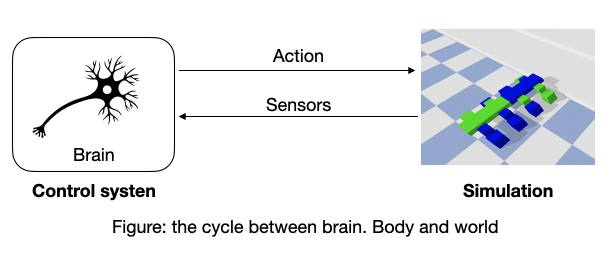
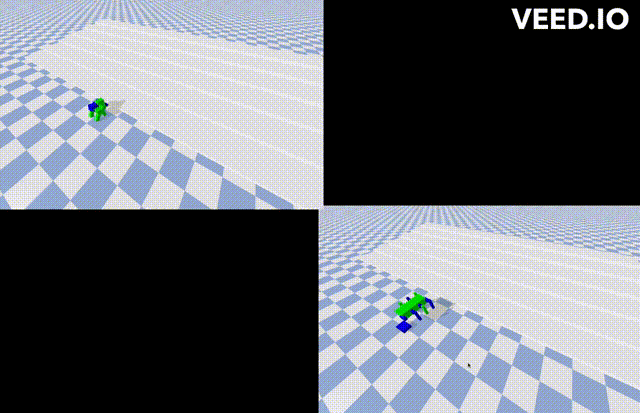

# Northwestern University Course - Artificial Life

## Assignment 7: expand the design space of your random creature generator to 3D

[video](https://youtu.be/7ln4_slcQMs)

### Step0. Overview

  In this assignment, we expand the design space ("morphospace") of random creature generator from asgmt 6 by allowing the chain to branch in 3D. not just random "snakes" (1D), but randomly shaped/sensorized/innervated/motorized "lizards" (2D) and "horses" (3D) too. Links with and without sensors should be colored green and blue, respectively. The inspiration of such design comes from insect crawling, illustrated in the following figure. 

  

### Step1. Run

  I use EA(Evolutation Algorithm) to make robot crawl. The EA try to maximize the fitness function. The fitness of EA is `Xposition`. Notice that this program needs at least 60 cpus to run. Because the `numberOfGenerations=3` and `populationSize=40`. The workflow of generating robots and training is illustrated in the following figure. 
  
    
  To run the EA, use following command: 
  ```
  cd Assignment7
  python search.py
  ```

### Step2. Replay

  After running EA, we get good neurons weights and use neuron-based control to replay the result, as illiustrated in the foloowing figure. To replay a single result in the video, run this:
  
  ```
  cd Assignment7
  python replay.py best
  ```


   | 
  :-------------------------:|:-------------------------:


### citations

  ```
  Evolving 3D Morphology and Behavior by Competition
  Evolving Virtual Creatures
  ludobots: https://www.reddit.com/r/ludobots/
  pics: https://slate.com/technology/2022/12/octopus-californicus-rescue-babies-eggs-raised.html
  pyrosim: https://github.com/ccappelle/pyrosim
  pybullet: https://docs.google.com/document/d/10sXEhzFRSnvFcl3XxNGhnD4N2SedqwdAvK3dsihxVUA/edit 
  ```
